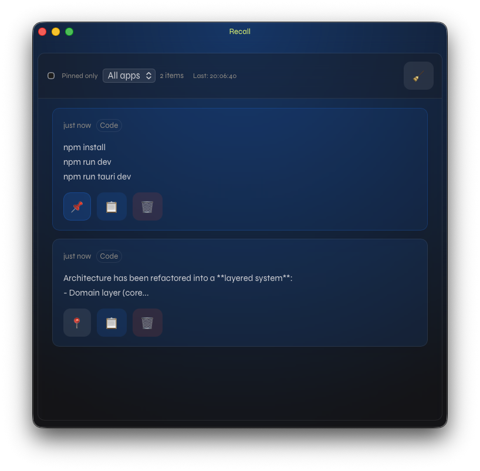

# Recall — Intelligent Clipboard


Recall captures clipboard items (text and images), stores them locally, and provides a Tauri + Preact UI to search, browse, pin, filter, restore, and copy transformed clipboard entries.

Current interaction surfaces:
- Full Recall history window for search, filtering, pinning, deleting, copying, and copy-format transformations.
- Quick copy overlay opened with `Cmd+Shift+V` on macOS, showing the last 10 clipboard items without opening the full window.
- Tray menu for pinned clipboard items.

Architecture has been refactored into a **layered system**:
- Domain layer (core types)
- Service layer (business logic)
- Persistence layer (SQLite + blobs)
- API layer (Tauri command boundary)
This separation improves testability, modularity, and alignment with Tauri v2 best practices.



---
## Quick start (development)

```sh
npm install
cd src-tauri/
npm run tauri dev
```

⸻

## Key features

- Clipboard history for text and images
- Search, classification filtering, and pinning
- Recent-history quick copy overlay with `Cmd+Shift+V`
- Number-key quick copy from the overlay: `1` through `0`
- Copy-format transformations from both the overlay and the full history window:
  - original copy
  - plain text
  - uppercase
  - lowercase
  - formatting cleanup
  - smart quote normalization
  - URL tracking parameter stripping
- Transparent app windows with enforced minimum sizes
- Main Recall window and quick overlay are mutually exclusive; they should not be visible at the same time

⸻

## Backend architecture (Rust)

### Layers

1. API layer (api/)

* Thin Tauri command wrappers
* Delegates all logic to services

2. Service layer

* EventService
* Owns business logic for retrieval, recent history, pinning, deletion, filtering, and search
* Replaces direct DB access from commands

3. Domain layer (domain/)

* Pure types:
    * Event
    * EventPayload
    * ClipboardContent
* Event types are framework-light; clipboard monitoring still integrates with Tauri clipboard APIs during the ongoing migration

4. Persistence layer (persistence/)

* SQLite access
* Schema definition
* Batched writer (EventWriter)

5. Config (config.rs)

* Centralized runtime configuration
* Environment-variable override support

⸻

### Clipboard event flow

1. Clipboard polling detects change
2. Domain converts raw input → ClipboardContent
3. Event writer validates + deduplicates
4. Persistence layer writes:
    * event row
    * optional blob row (images)
5. Frontend receives events:new update

⸻

### Copy flow

1. Frontend invokes `copy_event_to_clipboard(event_id, format?)`
2. Backend loads the event by ID
3. Text payloads are transformed when requested
4. Image payloads are restored from the blob store for original copy
5. Backend writes the selected representation to the system clipboard
6. The quick overlay hides after a successful copy

Recall does not capture the frontmost app, request Apple Events automation, restore focus to another app, or send `Cmd+V`.

⸻

### Available Tauri commands

All commands are service-backed:

* get_events(pinned_only?, source_app?, classification?, query?)
* get_recent_events(limit?)
* pin_event(id)
* unpin_event(id)
* delete_event(id)
* delete_all_events()
* copy_event_to_clipboard(event_id, format?)
* hide_quick_overlay()

⸻

## Frontend (src)

UI structure:

* EventTimeline — root controller for retrieval, filters, debounced search, and live event merging
* EventHeader — search-first input, filters, count, refresh state, and bulk delete control
* EventList — list container with search-aware empty state
* EventItem — event rendering with matched-term highlighting
* EventActions — pin, copy, copy-format, and delete actions
* QuickOverlay — last-10 quick copy overlay with keyboard navigation and copy formats
* ErrorBox — error display

Helpers:

* formatting.ts

⸻

#### Key improvements (post-refactor)

Architecture

* Clear separation: domain → service → persistence → API
* Commands reduced to thin adapters

Maintainability

* Business logic centralized in EventService
* Storage logic isolated in persistence/

Testability

* Domain and service layers are unit-test friendly
* Config injection enables deterministic tests

Reliability

* Improved error handling via structured AppError
* Better type safety in service-return boundaries

Retrieval

* Search is the primary retrieval path in the UI
* `get_events` accepts an optional `query` alongside pinned, app, and classification filters
* Backend search matches clipboard payload text, classification, source, common date formats, and any legacy source app/window title values already present in the database
* Multi-word searches require every term to match somewhere in the searchable fields
* Active search terms are highlighted in visible result metadata and content previews

Quick copy

* `Cmd+Shift+V` opens the quick overlay
* `1` through `0` copy one of the last 10 clips
* `Enter` copies the selected clip
* `P`, `U`, `L`, `F`, `Q`, and `T` apply plain text, uppercase, lowercase, formatting cleanup, quote conversion, and tracking cleanup transforms
* Main window and quick overlay hide each other to avoid stacked windows

⸻

Database

No schema changes for search-first retrieval:

* events
* blobs
* edges

Search currently uses parameterized SQLite `LIKE` predicates over existing event columns and remains backward compatible.

⸻

## Next steps

* Complete migration of remaining core logic into domain layer
* Introduce repository traits for persistence abstraction
* Add a full-text search index if the current `LIKE` search becomes a performance bottleneck
* Add observability (tracing per service call)
* Optimize clipboard polling efficiency
